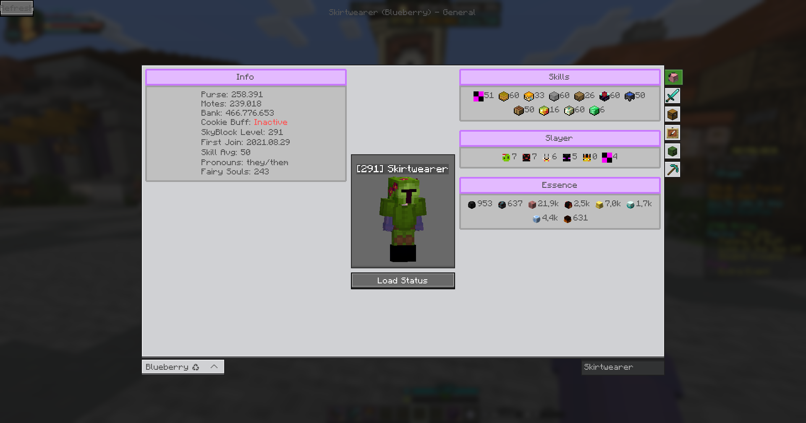
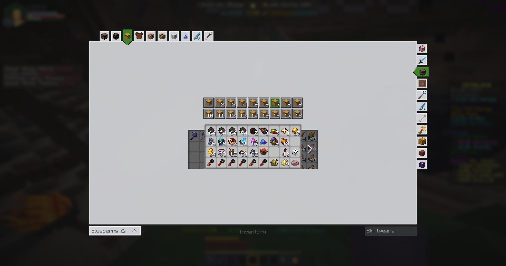
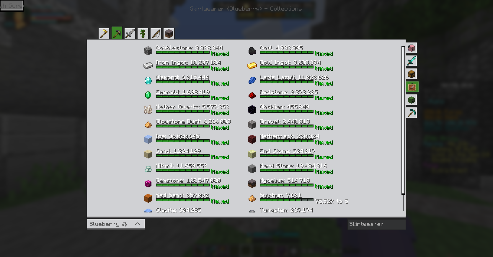
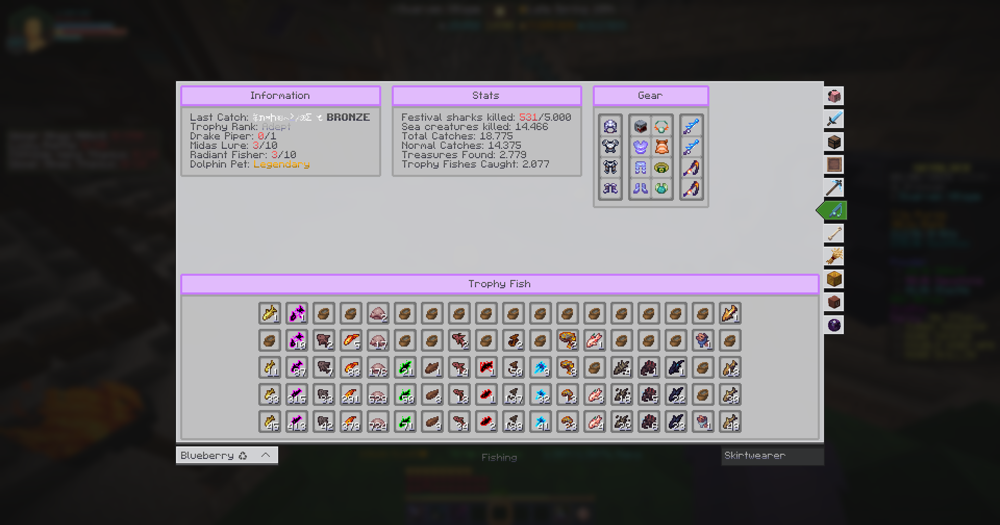

<h1 align="center">
  SkyBlock Profile Viewer
</h1>

<!---->

A Profile Viewer for Hypixel SkyBlock, developed with love and passion.

The Profile Viewer can be opened with ``/pv`` for your own Profile, or ``/pv <username>`` for someone else.
 You can switch between the tabs using the buttons on the right side of the UI.
 If a tab has multiple categories, you can switch between them using the buttons on the top of the UI.

> [!WARNING]
> The mod is still in development, design is subject to change.
> Screenshots may be very outdated.
> Visit the [TODO.md](./TODO.md) for a list of features that are planned to be added.

### 🏠 Home Tab

Designed to be simple and to show off the main aspects of the player's profile.
 Designed with a purpose to be screenshot-able and shareable.

### 📦 Inventory Tab

Switch between EnderChest, Backpack, ... pages using the custom build Carousel or the buttons up top.

### 📚 Collections Tab

### 🎣 Fishing Tab

All fishing related information, so Essence Upgrades, Trophy Fish, Gear, Stats, ... in one beautiful tab.

### 🔍 And many more tabs...

...we just didn't put them in the ReadMe. Look at them when pv'ing yourself or someone else!

### Mod Compatibility

#### SkyBlockMod

- **Issue**: [SkyBlockMod](https://github.com/kevinthegreat1/SkyblockMod-Fabric) is unsupported and introduces command shortcuts. While you can disable these
  shortcuts, doing so disables **all** of them.
- **Conflict**: The mod abbreviates `/party leave` to `pv`, which conflicts with our command.

#### SkyBlocker

- **Issue**: [SkyBlocker](https://github.com/SkyblockerMod/Skyblocker) includes its own Profile Viewer.
- **Resolution**: We override their `/pv` command with ours. If you prefer SkyBlocker's version, use `/skyblocker pv` instead.
- **Note**: We do not provide an option to disable this override, as using our mod implies a preference for our Profile Viewer.  
