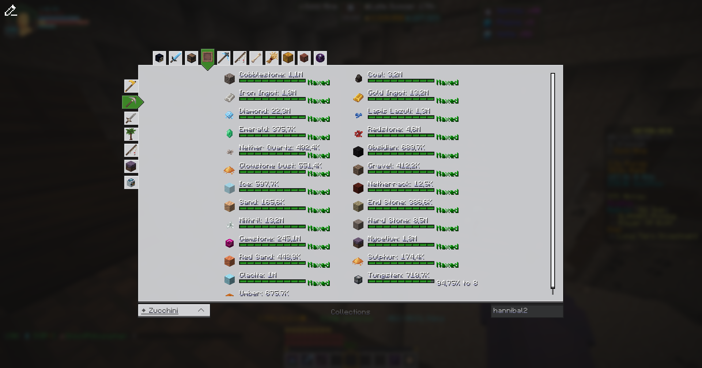

<h1 align="center">
  SkyBlock Profile Viewer
</h1>

<div align="center">

[](https://discord.gg/FsRc2GUwZR)
[](https://modrinth.com/mod/skyblock-profile-viewer)

</div>

A Profile Viewer for Hypixel SkyBlock, developed with love and passion.

The Profile Viewer can be opened with ``/pv`` for your own Profile, or ``/pv <username>`` for someone else.
<br/>You can switch between the tabs using the buttons on the right side of the UI.
<br/>If a tab has multiple categories, you can switch between them using the buttons on the top of the UI.

> [!WARNING]
> The mod is still in development, design is subject to change.
> Screenshots may be outdated.

## Features

- **Profile Spying**: Adds a button into the Hypixel Profile Viewer to open this Profile Viewer.
- **PronounDB**: Integrates with [PronounDB](https://pronoundb.org/) to display pronouns of the player.
- **Party Finder**: Sends a message to open the Profile Viewer for the player that just joined a party finder party.
- **Scaling** (_Experimental_): Automatically scales up some elements based on the player's screen size, to make it more readable on larger screens.
- and themes...

### Themes

Comes built-in with two themes: Default (Light) and Dark.
Quickly switch between them using the button in the top left corner of the UI.
You can also create your own theme, here's a guide:

<details>
<summary>Creating your own Theme</summary>

This needs to be done in a Texturepack.
In the Folder ``assets/skyblock-pv/themes/`` create a new file called ``<theme_name>.json``.
The json should have this layout:

```json
{
    "name": "<theme_name>",
    "textures": {
        ...
    },
    "colors": {
        ...
    }
}
```

To "replace" a texture, you specify the path to the texture you want to replace as the key, and the path to your new texture as the value.
E.g., this replaces the normal button texture with a custom one:

```json
{
    "name": "MyTheme",
    "textures": {
        "skyblock-pv:buttons/normal": "skyblock-pv:<theme>/buttons/normal"
    },
    "colors": {
        ...
    }
}
```

Some colors might look weird, as they look too similar to the background.
By default, it uses the minecraft colors.
The colors are the decimal format of the RGB values.

```json
{
    ...
    "colors": {
        "dark_gray": 11908533
    }
}
```

</details>

### Pages

#### 🏠 Home Tab


Designed to be simple and to show off the main aspects of the player's profile.
<br/>Designed with a purpose to be screenshot-able and shareable.

#### 📦 Inventory Tab


Switch between EnderChest, Backpack, ... pages using the custom build Carousel or the buttons up top.

#### 📚 Collections Tab



#### 🎣 Fishing Tab


All fishing related information, so Essence Upgrades, Trophy Fish, Gear, Stats, ... in one tab.

#### 🔍 And many more tabs...

...we just didn't put them in the ReadMe. Look at them when pv'ing yourself or someone else!

<details>
<summary>All Tabs</summary>

as of 2025-04-16

- Home
- Combat
    - Dungeons
    - Bestiary
  - Crimson Isle
    - Mob Kills
- Inventory
    - Main Inventory
    - Ender Chest
    - Backpacks
    - Wardrobe
    - Accessory
    - Sacks
  - Personal Vault, Potion Bag, Fishing Bag, Quiver, Candy Bag, etc.
- Collections
    - With Minions
- Mining
    - Main Mining
    - Mining Gear
    - HotM
    - Glacite
- Fishing
- Pets
- Farming
    - Main Farming
    - Visitors
    - Crops
    - Composter
- Museum
    - Weapons
    - Armor
- Chocolate Factory
- Rift
    - Main Rift
    - Inventory
    - Ender Chest

</details>

### Mod Compatibility

#### SkyBlockMod

- **Issue**: [SkyBlockMod](https://github.com/kevinthegreat1/SkyblockMod-Fabric) abbreviates `/party leave` to `pv`, which conflicts with our command.
- **Resolution**: We remove the `/pv` shortcut so that our command is used.
- **Note**: We do not provide an option to disable this behaviour, as using our mod implies you want the pv shortcut for profile viewer.

#### SkyBlocker

- **Issue**: [SkyBlocker](https://github.com/SkyblockerMod/Skyblocker) includes its own Profile Viewer.
- **Resolution**: We override their `/pv` command with ours. If you prefer SkyBlocker's version, use `/skyblocker pv` instead.
- **Note**: We do not provide an option to disable this override, as using our mod implies a preference for our Profile Viewer.  
